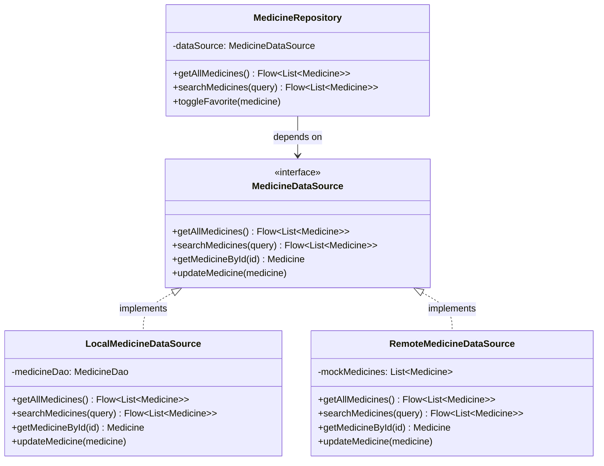
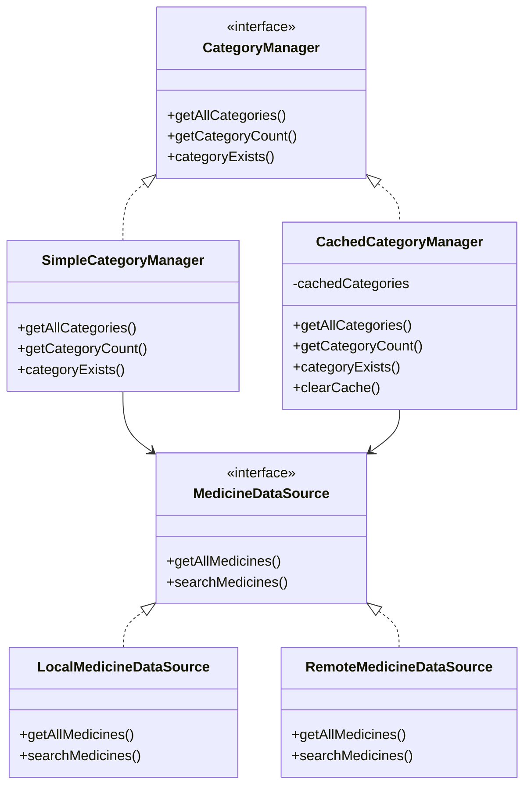

# Interface Implementation Demonstration

## Overview

This document demonstrates the implementation of **interface-based design pattern** in the UrukCare application, as requested by your professor.

## What Was Implemented

### 1. Interface Definition

**File**: [`MedicineDataSource.kt`](file:///Users/zubaidi/HTW/Mobile%20Computing%20/UrukCare-final%20version/app/src/main/java/com/urukcare/data/MedicineDataSource.kt)

```kotlin
interface MedicineDataSource {
    fun getAllMedicines(): Flow<List<Medicine>>
    fun searchMedicines(query: String): Flow<List<Medicine>>
    // ... other methods
}
```

This interface defines the **contract** for accessing medicine data.

---

### 2. First Implementation: LocalMedicineDataSource

**File**: [`LocalMedicineDataSource.kt`](file:///Users/zubaidi/HTW/Mobile%20Computing%20/UrukCare-final%20version/app/src/main/java/com/urukcare/data/LocalMedicineDataSource.kt)

```kotlin
class LocalMedicineDataSource(
    private val medicineDao: MedicineDao
) : MedicineDataSource {
    // Implementation using Room database
}
```

This class **implements** the interface using your local Room database.

---

### 3. Second Implementation: RemoteMedicineDataSource

**File**: [`RemoteMedicineDataSource.kt`](file:///Users/zubaidi/HTW/Mobile%20Computing%20/UrukCare-final%20version/app/src/main/java/com/urukcare/data/RemoteMedicineDataSource.kt)

```kotlin
class RemoteMedicineDataSource : MedicineDataSource {
    // Mock implementation (simulates remote API)
}
```

This class **implements** the same interface with mock/remote data.

---

### 4. Repository Using the Interface

**File**: [`MedicineRepository.kt`](file:///Users/zubaidi/HTW/Mobile%20Computing%20/UrukCare-final%20version/app/src/main/java/com/urukcare/data/MedicineRepository.kt)

```kotlin
class MedicineRepository(private val dataSource: MedicineDataSource) {
    // Uses interface, not concrete class
}
```

The repository now depends on the **interface**, not a specific implementation.

---

### 5. Usage in MainActivity

**File**: [`MainActivity.kt`](file:///Users/zubaidi/HTW/Mobile%20Computing%20/UrukCare-final%20version/app/src/main/java/com/urukcare/MainActivity.kt)

```kotlin
// Create implementation
val dataSource = LocalMedicineDataSource(database.medicineDao())

// Pass to repository (as interface type)
val repository = MedicineRepository(dataSource)
```

## Key Concepts Demonstrated

### ✅ Interface Definition
- Created `MedicineDataSource` interface with method signatures

### ✅ Multiple Implementations
- `LocalMedicineDataSource` - uses Room database
- `RemoteMedicineDataSource` - uses mock data

### ✅ Dependency on Abstraction
- `MedicineRepository` depends on interface, not concrete class
- Can easily swap implementations without changing repository code

## Benefits of This Pattern

| Benefit | Description |
|---------|-------------|
| **Flexibility** | Easy to switch between different data sources |
| **Testability** | Can create mock implementations for testing |
| **Maintainability** | Changes to implementation don't affect repository |
| **Extensibility** | Can add new implementations without modifying existing code |

## Example: Switching Implementations

To use the remote data source instead of local:

```kotlin
// In MainActivity.kt
// Instead of:
val dataSource = LocalMedicineDataSource(database.medicineDao())

// Use:
val dataSource = RemoteMedicineDataSource()

// Repository code stays the same!
val repository = MedicineRepository(dataSource)
```

## UML Diagram



## Summary

This implementation demonstrates:
1. **Interface**: `MedicineDataSource` defines the contract
2. **Multiple Implementations**: Two classes implement the same interface
3. **Polymorphism**: Repository uses interface type, works with any implementation
4. **Dependency Inversion**: High-level module (Repository) depends on abstraction (Interface), not concrete implementations

This is a fundamental **Object-Oriented Programming** principle that makes code more flexible and maintainable.

---

## Second Interface Example: CategoryManager

### Interface Definition

**File**: [`CategoryManager.kt`](file:///Users/zubaidi/HTW/Mobile%20Computing%20/UrukCare-final%20version/app/src/main/java/com/urukcare/data/CategoryManager.kt)

```kotlin
interface CategoryManager {
    suspend fun getAllCategories(): List<String>
    suspend fun getCategoryCount(): Int
    suspend fun categoryExists(categoryName: String): Boolean
    suspend fun getMedicineCountInCategory(categoryName: String): Int
}
```

---

### First Implementation: SimpleCategoryManager

**File**: [`SimpleCategoryManager.kt`](file:///Users/zubaidi/HTW/Mobile%20Computing%20/UrukCare-final%20version/app/src/main/java/com/urukcare/data/SimpleCategoryManager.kt)

```kotlin
class SimpleCategoryManager(
    private val dataSource: MedicineDataSource
) : CategoryManager {
    // Direct queries without caching
}
```

**Strategy**: Queries data source directly every time

---

### Second Implementation: CachedCategoryManager

**File**: [`CachedCategoryManager.kt`](file:///Users/zubaidi/HTW/Mobile%20Computing%20/UrukCare-final%20version/app/src/main/java/com/urukcare/data/CachedCategoryManager.kt)

```kotlin
class CachedCategoryManager(
    private val dataSource: MedicineDataSource
) : CategoryManager {
    private var cachedCategories: List<String>? = null
    // Caches results for better performance
}
```

**Strategy**: Caches category data for 60 seconds to reduce database queries

---

### Comparison Table

| Feature | SimpleCategoryManager | CachedCategoryManager |
|---------|----------------------|----------------------|
| **Performance** | Slower (queries DB each time) | Faster (uses cache) |
| **Memory** | Low memory usage | Higher memory usage |
| **Data Freshness** | Always fresh | Fresh within 60s |
| **Use Case** | Small datasets | Large datasets with frequent queries |

### UML Diagram - Both Interfaces



## Total Interfaces Created

✅ **2 Interfaces, 4 Implementations**

1. **MedicineDataSource** interface
   - `LocalMedicineDataSource` 
   - `RemoteMedicineDataSource`

2. **CategoryManager** interface
   - `SimpleCategoryManager`
   - `CachedCategoryManager`
