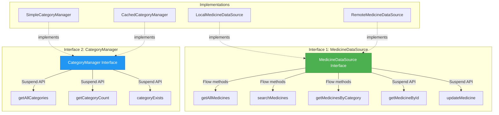

# Interface Summary - UrukCare Project

## Overview
This document lists **ALL interfaces** in the UrukCare project, showing their methods, return types, and whether they use Flow or suspend functions.

**Total Interfaces**: 3 (1 existing + 2 newly created)

---

---

## Interface 1: MedicineDao (Room DAO)

**Location**: `app/src/main/java/com/urukcare/data/MedicineDao.kt`

**Purpose**: Room Database Access Object - defines database operations

**Type**: Room DAO Interface (annotated with `@Dao`)

### Methods

| Method | Return Type | Type | Description |
|--------|-------------|------|-------------|
| `getAllMedicines()` | `Flow<List<Medicine>>` | **Flow** | Get all medicines from database |
| `getMedicineById(id: Int)` | `Medicine?` | **Suspend API** | Get single medicine by ID |
| `searchMedicines(query: String)` | `Flow<List<Medicine>>` | **Flow** | Search medicines by name |
| `getMedicinesByCategory(category: String)` | `Flow<List<Medicine>>` | **Flow** | Filter medicines by category |
| `getAllCategories()` | `Flow<List<String>>` | **Flow** | Get all category names |
| `getFavoriteMedicines()` | `Flow<List<Medicine>>` | **Flow** | Get favorite medicines |
| `insertAll(medicines: List<Medicine>)` | `Unit` | **Suspend API** | Insert multiple medicines |
| `update(medicine: Medicine)` | `Unit` | **Suspend API** | Update a medicine |
| `getCount()` | `Int` | **Suspend API** | Get total medicine count |

### Implementation

**Room automatically generates the implementation** at compile time. No manual implementation needed!

---

## Interface 2: MedicineDataSource

**Location**: `app/src/main/java/com/urukcare/data/MedicineDataSource.kt`

**Purpose**: Contract for accessing medicine data from different sources

### Methods

| Method | Return Type | Type | Description |
|--------|-------------|------|-------------|
| `getAllMedicines()` | `Flow<List<Medicine>>` | **Flow** | Get all medicines as a stream |
| `searchMedicines(query: String)` | `Flow<List<Medicine>>` | **Flow** | Search medicines by name |
| `getMedicinesByCategory(category: String)` | `Flow<List<Medicine>>` | **Flow** | Filter medicines by category |
| `getAllCategories()` | `Flow<List<String>>` | **Flow** | Get all category names |
| `getFavoriteMedicines()` | `Flow<List<Medicine>>` | **Flow** | Get favorite medicines |
| `getMedicineById(id: Int)` | `Medicine?` | **Suspend API** | Get single medicine by ID |
| `updateMedicine(medicine: Medicine)` | `Unit` | **Suspend API** | Update medicine data |

### Implementations

#### 1. LocalMedicineDataSource
**File**: `app/src/main/java/com/urukcare/data/LocalMedicineDataSource.kt`

```kotlin
class LocalMedicineDataSource(
    private val medicineDao: MedicineDao
) : MedicineDataSource
```

**Strategy**: Uses Room database through MedicineDao

#### 2. RemoteMedicineDataSource
**File**: `app/src/main/java/com/urukcare/data/RemoteMedicineDataSource.kt`

```kotlin
class RemoteMedicineDataSource : MedicineDataSource
```

**Strategy**: Returns mock data (simulates remote API)

---

## Interface 3: CategoryManager

**Location**: `app/src/main/java/com/urukcare/data/CategoryManager.kt`

**Purpose**: Contract for managing medicine categories

### Methods

| Method | Return Type | Type | Description |
|--------|-------------|------|-------------|
| `getAllCategories()` | `List<String>` | **Suspend API** | Get all category names |
| `getCategoryCount()` | `Int` | **Suspend API** | Get total number of categories |
| `categoryExists(categoryName: String)` | `Boolean` | **Suspend API** | Check if category exists |
| `getMedicineCountInCategory(categoryName: String)` | `Int` | **Suspend API** | Count medicines in category |

### Implementations

#### 1. SimpleCategoryManager
**File**: `app/src/main/java/com/urukcare/data/SimpleCategoryManager.kt`

```kotlin
class SimpleCategoryManager(
    private val dataSource: MedicineDataSource
) : CategoryManager
```

**Strategy**: Direct queries to data source (no caching)

#### 2. CachedCategoryManager
**File**: `app/src/main/java/com/urukcare/data/CachedCategoryManager.kt`

```kotlin
class CachedCategoryManager(
    private val dataSource: MedicineDataSource
) : CategoryManager
```

**Strategy**: Caches category data for 60 seconds to improve performance

---

## Flow vs Suspend API Comparison

### Flow Methods (Reactive Streams)
- **Use Case**: Continuous data observation, real-time updates
- **Return Type**: `Flow<T>`
- **Behavior**: Emits multiple values over time
- **Example**: `getAllMedicines()` - updates UI automatically when database changes

**Methods using Flow**:
- ✅ `MedicineDataSource.getAllMedicines()`
- ✅ `MedicineDataSource.searchMedicines()`
- ✅ `MedicineDataSource.getMedicinesByCategory()`
- ✅ `MedicineDataSource.getAllCategories()`
- ✅ `MedicineDataSource.getFavoriteMedicines()`

### Suspend API Methods (One-time Operations)
- **Use Case**: Single operations, one-time data fetch
- **Return Type**: Regular types (`Int`, `Boolean`, `Medicine?`, etc.)
- **Behavior**: Returns single value once
- **Example**: `getMedicineById(id)` - fetch once and return

**Methods using Suspend**:
- ✅ `MedicineDataSource.getMedicineById()`
- ✅ `MedicineDataSource.updateMedicine()`
- ✅ `CategoryManager.getAllCategories()`
- ✅ `CategoryManager.getCategoryCount()`
- ✅ `CategoryManager.categoryExists()`
- ✅ `CategoryManager.getMedicineCountInCategory()`

---

## Architecture Diagram



---

## Summary Statistics

| Metric | Count |
|--------|-------|
| **Total Interfaces** | 3 |
| **Total Implementations** | 4 (+ 1 auto-generated by Room) |
| **Flow Methods** | 10 |
| **Suspend API Methods** | 11 |
| **Total Methods** | 21 |

### Breakdown by Interface

| Interface | Flow Methods | Suspend Methods | Total | Implementations |
|-----------|--------------|-----------------|-------|-----------------|
| **MedicineDao** | 5 | 4 | 9 | Auto-generated by Room |
| **MedicineDataSource** | 5 | 2 | 7 | 2 (Local, Remote) |
| **CategoryManager** | 0 | 4 | 4 | 2 (Simple, Cached) |

---

## Usage Example

### Using Flow (Reactive)
```kotlin
// Automatically updates when database changes
viewModelScope.launch {
    dataSource.getAllMedicines().collect { medicines ->
        // UI updates automatically
        _medicineList.value = medicines
    }
}
```

### Using Suspend API (One-time)
```kotlin
// Single fetch operation
viewModelScope.launch {
    val medicine = dataSource.getMedicineById(123)
    // Use medicine once
}
```

---

## Files Location

All interface files are located in:
```
app/src/main/java/com/urukcare/data/
├── MedicineDao.kt                  (Interface - Room DAO) ⭐ EXISTING
├── MedicineDataSource.kt           (Interface) ✨ NEW
├── LocalMedicineDataSource.kt      (Implementation) ✨ NEW
├── RemoteMedicineDataSource.kt     (Implementation) ✨ NEW
├── CategoryManager.kt              (Interface) ✨ NEW
├── SimpleCategoryManager.kt        (Implementation) ✨ NEW
└── CachedCategoryManager.kt        (Implementation) ✨ NEW
```
